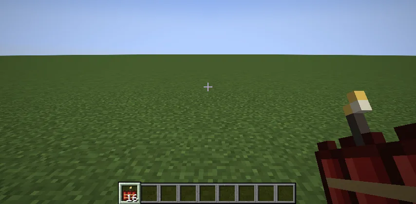
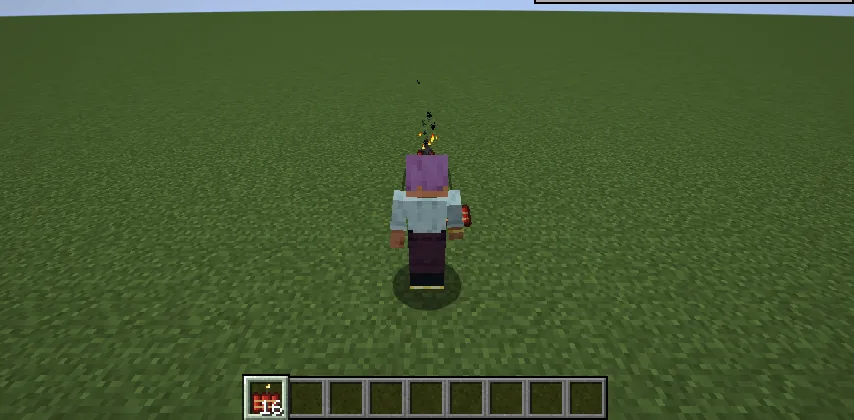
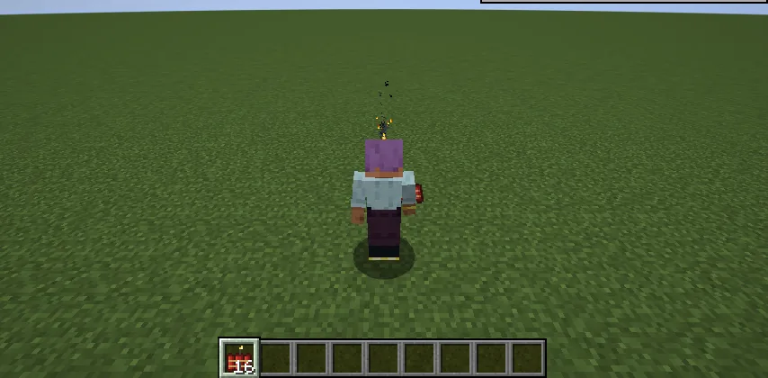
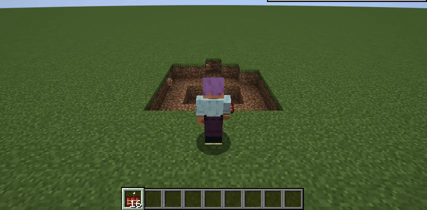

TNT is a demolition charge: a block to lay, light and run from. **Dynamite is a grenade.**
Right-click throws the bundle, already lit. It flies, bounces, lies hissing and smoking, and goes off
**two seconds after the throw**, wherever it is: in the air, over a wall, down a hole.

## Making it

Shapeless, at a crafting table: **3 gunpowder, 2 paper and 1 string**, for one bundle. It's also in
the **Dynamite** creative tab.

## Using it

- **Right-click to throw**, like a snowball, a little over a block a tick. There's a short wait
  between throws. A dispenser throws it lit too.
- **The fuse is a timer, not a trigger.** It doesn't go off when it hits something: it thuds, hops a
  little, tumbles a block or so, and lies still. **Two seconds after the throw**, it goes off.
- **The blast** is half a block of TNT's: it reaches about three blocks, digs a shallow crater in
  dirt and a block or so into stone, and drops the blocks it breaks. No fire. It hurts anything near
  it, **you included**. Under water it hurts and breaks nothing.
- You'll hear a whoosh as it's thrown, the fuse hissing, a thud where it lands, and the bang.

